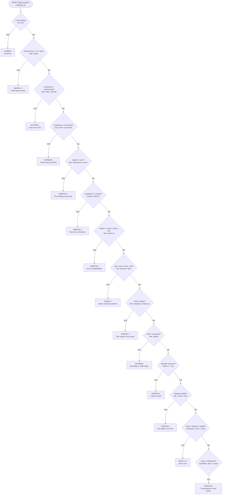

```mermaid
graph TD
    Start([START: Target sentence containing 'be']) --> Q1{Is it the phrase<br>'let X be'?}
    
    Q1 -- YES --> S1[0750695-v<br>Let her be.]
    Q1 -- NO --> Q2{Perfect Tense + 'to' + Dest?<br>Sub: 'visited'}
    
    Q2 -- YES --> S2[85478917-v<br>I have been to Paris.]
    Q2 -- NO --> Q3{Complement = time/duration?<br>Sub: 'takes / will take'}
    
    Q3 -- YES --> S3[02273091-v<br>I may be an hour.]
    Q3 -- NO --> Q4{Complement = price/value?<br>Sub: 'costs / is priced at'}
    
    Q4 -- YES --> S4[02708368-v<br>These shoes are $100.]
    Q4 -- NO --> Q5{Subject = event?<br>Sub: 'takes place / occurs'}
    
    Q5 -- YES --> S5[00340744-v<br>The meeting is tomorrow.]
    Q5 -- NO --> Q6{Complement = location?<br>Answers 'Where?'}
    
    Q6 -- YES --> S6[02661230-v<br>The tool is in the back.]
    Q6 -- NO --> Q7{Subject = person, Comp = job?<br>Sub: 'works as'}
    
    Q7 -- YES --> S7[02450790-v<br>He is a herpetologist.]
    Q7 -- NO --> Q8{Sub = actor, Comp = role?<br>Sub: 'portrays / plays'}
    
    Q8 -- YES --> S8[0703567-v<br>Derek Jacobi was Hamlet.]
    Q8 -- NO --> Q9{Forms a whole?<br>Sub: 'comprises / makes up'}
    
    Q9 -- YES --> S9[02626667-v<br>This money is my income.]
    Q9 -- NO --> Q10{Math / conversion?<br>Sub: 'equals'}
    
    Q10 -- YES --> S10[02670846-v<br>One dollar is 1,000 rubles.]
    Q10 -- NO --> Q11{Absolute existence?<br>'There is' / 'I am'}
    
    Q11 -- YES --> S11[02609706-v<br>Is there a God?]
    Q11 -- NO --> Q12{Biological vitality?<br>Sub: 'is alive / lives'}
    
    Q12 -- YES --> S12[02620216-v<br>Our leader is no more.]
    Q12 -- NO --> Q13{Comp = Adjective / Quality?<br>Asymmetric: Sub != Comp}
    
    Q13 -- YES --> S13[02610777-v<br>John is rich.]
    Q13 -- NO --> Q14{Comp = Definite NP?<br>Symmetric: Sub == Comp}
    
    Q14 -- YES --> S14[02622439-v<br>The president is John Smith.]
```
